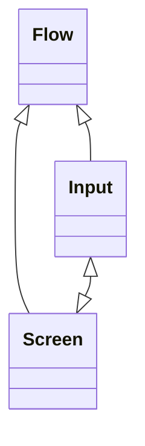

# Form Flow Starter App #

This is a standard Spring Boot application that uses Form Flow Builder tools as a library. It can
be customized to meet any needs of a web app, and is meant to be built upon.

It contains examples code for a simple, generic application for public benefits. An applicant can
input their personal information, upload supporting documents, receive a confirmation text message, 
and receive a confirmation email with a filled-in application PDF. The example flow is content is in
both English and Spanish.

The example application can be viewed [here](https://example.com).

To power the form flow logic this app depends on the `form-flows` Java library. That library is
included in `build.gradle` along with all other dependencies. The codebase for the `form-flows`
package is [open-source](https://example.com).

Out-of-the-box, integrations can be set up with the following third-party services:

- Google Analytics
- Mixpanel
- Optimizely
- Intercom
- Google Ads
- Facebook Ads

These are configurable in `application.yaml`.

The documentation that follows describes the main concepts needed to set up a new form flow and
accompanying features like PDF generation or confirmation text messages and emails.

## Form Flow Concepts ##

* Flows
* Inputs
* Screens
* Conditions

Flows are the top-level construct. A flow has many inputs to receive user data (e.g. first name, zip
code, email, uploads). A flow also has many screens. Each screen can be made up of one or more
inputs. A flow has an ordering of screens, and can use defined conditions to skip screens. 
Conditions can also be used on individual screens to show or hide content.



## Defining A Flow ##

Flows are defined in YAML, in `resources/flows`. An example is in `resources/flows/apply.yaml`. 
It looks like this:

```yaml
apply:
  - screen1
  - screen2:
    nextPages:
      - screen3:
          condition: showScreen3
```

```java
public enum Conditions {
  showScreen3 -> appliedForSnap && appliedForCcap,
} 
```

## Defining Inputs ##

Inputs are defined in YAML, in `resources/inputs`. An example is in `resources/inputs/apply.yaml`.

```yaml
apply:
  - firstName
    type: TEXT
    validation: REQUIRED
  - lastName
    type: TEXT
    validation: REQUIRED
```

Java class brainstorm:

```java
class ApplyModel extends FlowModel {
  public TextInput firstName;
  public EmailInput email;
  public PhoneInput phone;
  
  firstName -> {validation.REQUIRED}
}

```

## Defining Screens ##

Screens are defined as HTML using the Thymeleaf templating engine. Building block components are
provided to quickly build pages using Thymeleaf fragments.

Components provided include:

<!--- 
Open Ended Questions: 
- How does this work with definiting input fields? 
-- Should input YAML definitions include values and validations? What about conditions?
- How does this work with conditional logic?
- What components do we really need? Where do we draw the line of this is
a useful component to have vs this could just be written as HTML? 
- How do we handle follow ups on inputs?
--->


__Form Components__
- Form
- TextInput
- TextAreaInput
- DateInput
- NumberInput
- RadioInput
- CheckBoxInput
- SelectInput
- YesOrNoInput
- MoneyInput
- PhoneInput
- SsnInput
- FormSubmitButton

__Page Layout Components__
- CardPage
- PageHeader
- PageHeaderSubtext
- Accordion
- Reveal


React brainstorm:

```jsx
<FormCard>
  <CardHeader>${tell-us.header}</CardHeader>
  <Form>
    <TextInput name="applicantFirstName"
               helpText="${legally-as-it-appears}"
               label="${what-is-your-first-name}"/>

    <TextInput name="applicantLastName"
               helpText="${legally-as-it-appears}"
               label="${what-is-your-last-name}"/>
    
    
  </Form>
</FormCard>

```

## Defining Conditions ##

Conditions are defined in Java.