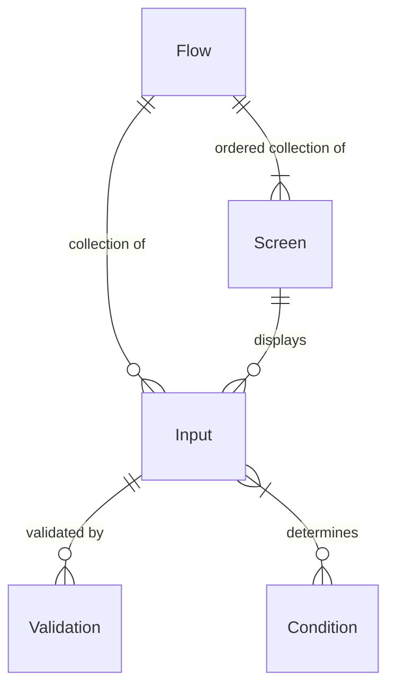
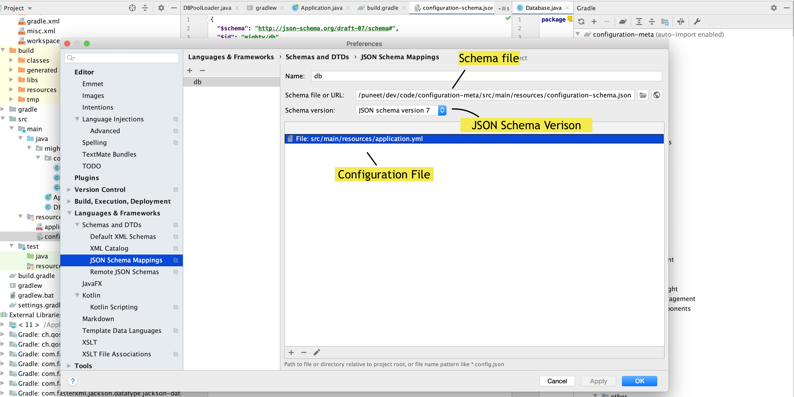

# Form Flow Starter App #

This is a standard Spring Boot application that uses the `form-flows` Java package as a library. It 
can be customized to meet the needs of a web app, and is meant to be built upon. It's a plain, 
boring (but modern) Spring app that uses common, frequently-used libraries throughout.

It contains example code for a simple, generic application for public benefits. An applicant 
can fill out screens with their basic info, upload supporting documents, then submit it all. 
Upon submission, they receive a simple SMS confirmation and a receipt email with a filled-in 
application PDF. The entire experience is in both English and Spanish.

The example application can be viewed [here](https://example.com).

To power the form flow logic, this app depends on the `form-flows` Java library. That library is
included in `build.gradle` along with all other dependencies. The codebase for the `form-flows`
package is [open source](https://example.com).

Out-of-the-box, integrations can be set up with common third-party services:

- Intercom
- Google Analytics
- Mixpanel
- Optimizely
- Google Ads
- Facebook Ads

The relevant service keys and other settings are configurable in `application.yaml`.

## Form Flow Concepts ##

* Flows
* Inputs
* Screens
* Conditions
* Validations

Flows are the top-level construct. A flow has many inputs to accept user data (e.g. first name, zip
code, email, file upload). Each input can have zero to many validations.

A flow also has many screens. Each screen can be made up of one or more inputs. A flow has an 
ordering of screens, and can use defined conditions to skip screens. Conditions are based on
submitted inputs. Conditions can also be used on individual screens to show or hide content.



## Defining Flows ##

TODO: Update to YAML

To start, define a new flow by creating a Java class that extends the `Flow` class and defines 
an empty `screens` instance variable:

```java
class Apply extends Flow {
  
  public ArrayList<Screen> screens = List.of();
  
}
```

We'll add to this more as we define our screens and inputs! 

## Defining Screens and Inputs ##

TODO: Update

Screens follow the classic MVC (model-view-controller) pattern:

1. A back-end **model** that's a Java class that extends `Screen`.
2. A Thymeleaf HTML template as the **view**.
3. A Spring **controller** called `ScreenController`. Generally, it won't need to be modified just 
   to add a new screen to the flow.

Here's a new `Screen` class that represents the model:

```java
class AboutYou extends Screen {
  
  public boolean skip() {
    return false;
  }
  
}
```

The model implements a `skip()` method, which is `false` by default.

With the new `Screen` class, an instance can be now added to the `Apply` flow:

```java
class Apply extends Flow {
  
  public ArrayList<Screen> screens = List.of(
      new AboutYou()
  );
  
  @NotBlank
  TextInput firstName;
  
  @NotBlank
  TextInput lastName;
  
  EmailInput emailAddress;

  PhoneInput phoneNumber;
}
```

In addition to adding an instance of the `AboutYou` screen to the `screens` list, inputs are
added to the flow as well. The name inputs have `@NotBlank` validations (via [Bean Validation](https://beanvalidation.org/)) 
applied, while the email and phone inputs use validations built into the `EmailInput` and 
`PhoneInput` classes, respectively.

The built-in input types are:

- `Checkbox`
- `Date`
- `Fieldset`
- `Money`
- `Number`
- `Radio`
- `Select`
- `SelectOption`
- `Text`
- `TextArea`
- `Phone`
- `Ssn`
- `YesOrNo`
- `Submit`
- `FileUpload` (TBD)

Custom input types can be created by extending the `Input` class, while custom validations can 
be implemented through the [Bean Validation library](https://reflectoring.io/bean-validation-with-spring-boot/#a-custom-validator-with-spring-boot).


Then, screen views are defined as HTML with the [Thymeleaf templating engine](https://www.thymeleaf.org/).
Thymeleaf fragments (building block components) are provided by the `form-flows` library to 
produce semantically-correct HTML and CSS from the [Honeycrisp design system](https://honeycrisp.herokuapp.com/).

When setting up a new flow, create a folder in `src/main/resources` to hold all HTML files. Then 
add a new HTML file `about-you.html` [in the flow's templates folder](src/main/resources/templates):

```html
<!DOCTYPE html>
<html th:lang="${#locale.language}">
<head th:replace="fragments/head :: head(title='About You')"></head>
<body>
<div class="page-wrapper">
   <div th:replace="fragments/toolbar :: toolbar"></div>
   <section class="slab">
      <div class="grid">
         <main id="content" role="main" class="form-card spacing-above-35">
            <th:block th:replace="'icons' :: 'clipboard'"></th:block>
            <th:block th:replace="'content' :: cardHeader(header='Tell us about yourself')" />
            <th:block th:replace="'inputs' :: textInput(name='firstName', label='What's your first name?')" />
            <th:block th:replace="'inputs' :: textInput(name='firstName', label='What's your last name?')" />
            <th:block th:replace="'inputs' :: textInput(name='emailAddress', label='What's your email address?')" />
            <th:block th:replace="'inputs' :: submitInput()" />
         </main>
      </div>
   </section>
</div>
<th:block th:replace="fragments/footer :: footer" />
</body>
</html>
```

## Defining Subflows ##

What do you need to do to create a subflow?
- In flow config:
  - You need to define `subflow`
  - You need to create a name for your subflow
  - You need to define `entryScreen`, `iterationStartScreen`, `reviewScreen`, `deleteConfirmationScreen`
  - Add all subflow screens into the `flow`, with `subflow: <subflow-name>`
  - Note for `entryScreen`, `reviewScreen`, and `deleteConfirmationScreen`, they don't have to have `subflow: <subflow-name>`
  - Note for screens that aren't ever defined in `NextScreens` (delete confirmation screen), they still need to be somewhere in the `flow` 
- Define fields that appear in subflow screens just like you would in a `screen`, in your flow Java Class
- Define `screen` templates in `resources/templates/<flow-name>`

### Example `flow-config.yaml` with a docs subflow ###

```yaml
name: docFlow
flow:
  first:
    nextScreens:
      - name: second
  second:
    nextScreens:
      - name: docsEntry
  docsEntry:
    nextScreens:
      - name: docsStart
  docsStart:
    subflow: docs
    nextScreens:
      - name: docsInfo
  docsInfo:
    subflow: docs
    nextScreens:
      - name: docsReview
  docsReview:
    nextScreens:
      - name: success
  success:
    nextScreens:
  # NOTE: this screen still needs to be defined in `flow` to be rendered even though
  # it isn't the nextScreen of any other Screen
  docsDeleteConfirmation:
    nextScreens:
subflow:
  docs:
    entryScreen: docsEntry
    iterationStartScreen: docsStart
    reviewScreen: docsReview
    deleteConfirmationScreen: docsDeleteConfirmation
```

### When do you need to define `subflow` on a screen? ###


## About Submissions ##

Submission data is stored in the `Submission` object, persisted to PostgreSQL via the Hibernate ORM.

```java
class Submission {
  
  @Id
  @GeneratedValue
  private Long id;
  
  private String flow;
  
  @CreationTimestamp
  @Temporal(TIMESTAMP)
  private Timestamp createdAt;

  @UpdateTimestamp
  @Temporal(TIMESTAMP)
  private Timestamp updatedAt;

  @Temporal(TIMESTAMP)
  private Timestamp submittedAt;
   
  @Type(JsonType.class)
  private Map<String, String> inputData = new HashMap<>();
  
}
```

The `inputData` field is a JSON object that stores input data from the inputs as a given 
flow progresses. It can be used for defining conditions.

An instance variable `currentSubmission` is available for use in the `ScreenController` and 
`inputData` is placed on the Thymeleaf model.

## Defining Conditions ##

Conditions are defined in Java as methods, and can read from the `currentSubmission` object. When 
defining new conditions as methods, the instance variable `inputData` is accessible.

```java
public class ApplyConditions extends FlowConditions {
  
  public boolean isGmailUser() {
    return inputData.get('emailAddress').contains("gmail.com");
  }
  
} 
```

### Using conditions in templates

You can pull in conditions into a Thymeleaf with the T operator, then use the variable to define show logic:

```html
<div
  th:with="showCondition=${T(org.codeforamerica.formflowstarter.app.config.ConditionDefinitions).<show-method>()}">
   <h1 th:if="showCondition">Conditionally show this element</h1>
</div>
```

## Defining Static Pages ##


Unlike Screens, Static Pages are HTML content not part of a flow. Examples include the home page, 
privacy policy, or FAQ. This starter app contains a home page (`index.html`) and FAQ (`faq.html`)
as examples in the `resources/templates` folder.

To add a new Static Page:

1. Add an annotated method (`@GetMapping`) to the `StaticPageController`
2. Create a page template in `src/resources/templates`.

The template HTML can look like:

```html
<!DOCTYPE html>
<html th:lang="${#locale.language}">
<head th:replace="fragments/head :: head(title='')"></head>
<body>
<div class="page-wrapper">
   <th:block th:replace="fragments/toolbar :: toolbar" />
   <th:block th:replace="fragments/demoBanner :: demoBanner" />
   <section class="slab">
      <div class="grid">
         <div class="grid__item">
            <h1 class="spacing-below-35"></h1>
         </div>
      </div>
   </section>
   <main id="content" role="main" class="slab slab--white">

   </main>
</div>
<th:block th:replace="fragments/footer :: footer" />
</body>
</html>
```

The IntelliJ Live Template for the above example can be generated with `cfa:staticPage`.

## About IntelliJ Live Templates ##

As a team, we use [IntelliJ](https://www.jetbrains.com/idea/) and can use the [Live Templates](https://www.jetbrains.com/help/idea/using-live-templates.html) feature to quickly build 
Thymeleaf templates.

Support for importing/exporting these Live Templates is a [buggy process](https://youtrack. jetbrains.com/issue/IDEA-184753) that can sometimes wipe away all of your previous settings. So we're going to use a copy/paste approach.

### Applying Live Templates to your IntelliJ IDE ###

1. Open the [intellij-live-templates/CfA.xml](intellij-live-templates/CfA.xml) from the root of 
   this repo
2. Copy the whole file
3. Open Preferences (`cmd + ,`), search or find the section "Live Templates"
4. If there isn't a template group already called CfA, create one by pressing the "+" in the top 
   right area and selecting "Template group..."
5. Highlight the template group "CfA", right click and "Paste"
6. You should now see Live templates with the prefix "cfa:" populated in the template group

### Using Live Templates ###

Once you have Live Templates installed on your IntelliJ IDE, in `.html` files you can use our 
Live Templates by typing `cfa:` and a list of templates to autofill will show itself.

### Contribute new Live Templates ###

1. Open Preferences (`cmd + ,`), search or find the section "Live Templates"
2. Find the Live Template you want to contribute
3. Right click and "Copy" (this will copy the Live Template in XML form)
4. Open [intellij-live-templates/CfA.xml](intellij-live-templates/CfA.xml) in this repo
5. Paste at the bottom of the file
6. Commit to GitHub
7. Now others can copy/paste your Live Templates

## Connect flows config schema with IntelliJ IDE ##

We use [JSON schema](https://json-schema.org/understanding-json-schema/index.html) to autocomplete and validate the `flows-config.yaml` file.

You must manually connect the schema to the local file in your instance of IntelliJ IDE.

1. Open IntelliJ preferences (`Cmd + ,` on mac)
2. Navigate to "JSON Schema Mappings"
3. se the "+" in the top left to add a new mapping
4. Name can be anything (I use "flow config")
5. "Schema file or URL" needs to be set to the `src/main/resources/flows-config-schema.json`
6. "Schema version" set to "JSON Schema version 7"
7. Use the "+" to add a new file and connect to `src/main/resources/flows-config.yaml`

To confirm that the connection is work, go into `flows-config.yaml` and see if autocomplete is appearing for you.


