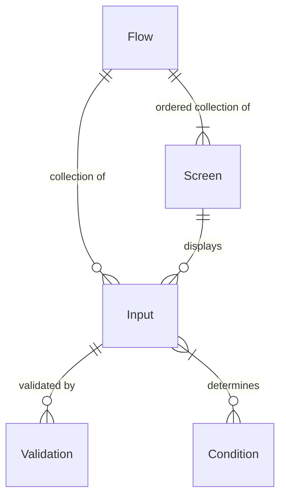

# Form Flow Starter App #

This is a standard Spring Boot application that uses Form Flow Builder tools as a library. It can
be customized to meet any needs of a web app, and is meant to be built upon.

It contains examples code for a simple, generic application for public benefits. An applicant can
input their personal information, upload supporting documents, receive a confirmation text message, 
and receive a confirmation email with a filled-in application PDF. The example flow is content is in
both English and Spanish.

The example application can be viewed [here](https://example.com).

To power the form flow logic this app depends on the `form-flows` Java library. That library is
included in `build.gradle` along with all other dependencies. The codebase for the `form-flows`
package is [open-source](https://example.com).

Out-of-the-box, integrations can be set up with the following third-party services:

- Google Analytics
- Mixpanel
- Optimizely
- Intercom
- Google Ads
- Facebook Ads

These are configurable in `application.yaml`.

The documentation that follows describes the main concepts needed to set up a new form flow and
accompanying features like PDF generation or confirmation text messages and emails.

## Form Flow Concepts ##

* Flows
* Inputs
* Screens
* Conditions

Flows are the top-level construct. A flow has many inputs to receive user data (e.g. first name, zip
code, email, uploads). A flow also has many screens. Each screen can be made up of one or more
inputs. A flow has an ordering of screens, and can use defined conditions to skip screens. 
Conditions can also be used on individual screens to show or hide content.



## Defining Screens ##

Screens are defined as HTML using the Thymeleaf templating engine. Building block components are
provided to quickly build pages using Thymeleaf fragments.


Components provided include:

__Form Components__
- Form
- TextInput
- TextAreaInput
- DateInput
- NumberInput
- RadioInput
- CheckBoxInput
- SelectInput
- MoneyInput
- PhoneInput
- SsnInput
- DocumentUploadInput
- YesOrNoInput
- FormSubmitButton

__Page Layout Components__
- CardPage
- PageHeader
- PageHeaderSubtext
- Accordion
- Reveal


```html


<th:block th:replace="'fragments/icons' :: smiley" />
<th:block th:replace="'fragments/header' :: header('Tell Us About Yourself', 
                                                   'Tell us some basic information.')" />

<th:block th:replace="fragments/form :: form_start" />
  <th:block th:replace="fragments/input :: textInput(flow.firstName)" />
<th:block th:replace="fragments/form :: form_end" />

---

<main id="content" role="main" class="form-card">

  <div th:replace="'fragments/icons' :: smiley"></div>
  <h1 th:replace="'fragments/header' :: header('Tell Us About Yourself')"></h1>
  
  
  <p id="page-header-help-message" th:text="Tell us some basic information."></p>
  
  
  </div>
  <th:block th:if="${pageNameContext != null}">
    <div th:replace="${pageNameContext} :: ${pageNameContext}"></div>
  </th:block>

  <div class="grid__item spacing-below-60">
    <!--Form page-->
    <form id="page-form" th:if="${page.inputs != null && !page.inputs.isEmpty()}"
          autocomplete="off"
          method="post" th:action="@{${postTo}}">
      <div th:each="input: ${page.inputs}">
        <div
            th:replace="'fragments/inputs/input-with-followups' :: input-with-followups(${input}, ${data})"></div>
      </div>
      <p th:if="${page.hasCardFooterTextKey()}" id="card-footer" class="spacing-below-60 spacing-above-minus-25"
         th:text="#{${page.cardFooterTextKey}}"></p>
      <button id="form-submit-button" th:if="${page.hasPrimaryButton}"
              class="button button--primary"
              type="submit"
              th:text="#{${page.primaryButtonTextKey}}"></button>
      <th:block th:if="${page.hasAlertBox()}">
        <div th:replace="fragments/alertBox :: alertBox(${page})"></div>
      </th:block>
    </form>

    <!--Static page-->
    <div th:if="${page.inputs == null || page.inputs.isEmpty()}">
      <a th:if="${page.hasPrimaryButton}" class="button button--primary"
         th:href="'/pages/'+${pageName}+'/navigation?option=0'"
         th:text="#{${page.primaryButtonTextKey}}"></a>
    </div>
    <a th:if="${page.hasSubtleLinkTextKey()}" class="link--subtle" id="subtle-link"
       th:href="|/pages/${page.subtleLinkTargetPage}|"
       th:text="#{${page.subtleLinkTextKey}}"></a>
  </div>
</main>


```

React brainstorm:

```jsx
<FormCard>
  <CardHeader>${tell-us.header}</CardHeader>
  <Form>
    <TextInput name="applicantFirstName"
               helpText="${legally-as-it-appears}"
               label="${what-is-your-first-name}"/>

    <TextInput name="applicantLastName"
               helpText="${legally-as-it-appears}"
               label="${what-is-your-last-name}"/>
    
    
  </Form>
</FormCard>

```


## Defining Inputs ##

Inputs are defined in YAML, in `resources/inputs`. An example is in `resources/inputs/apply.yaml`.

```yaml
apply:
  - firstName
    type: TEXT
    validation: REQUIRED
  - lastName
    type: TEXT
    validation: REQUIRED
```


---

Brain storming

```yaml
apply:
  - firstName
    type: TEXT
    validation: REQUIRED
  - gender
    type: RADIO
    validation: REQUIRED
    options:
      - MALE
      - FEMALE
      - ELDRITCH_HORROR
  - city
    type:
```

```html
<th:block th:replace="inputs :: text('Label', etc, ...)">
```

---

Java class brainstorm:

```java

interface Input {
  
  String value;
  
  boolean validate() {
    return true;
  }
}

class EmailInput implements Input {
  
  boolean validate() {
    value.isEmailFormatted();  
  }
  
}

class ApplyModel extends FlowModel {
  public TextInput firstName;
  public EmailInput email;
  public PhoneInput phone;
  
  
  firstName.validate() -> {firstName.value.isPresent()}
  // Do validation on fields
  firstName -> {validation.REQUIRED}
}

```

## Defining A Flow ##

Flows are defined in YAML, in `resources/flows`. An example is in `resources/flows/apply.yaml`.
It looks like this:

```yaml
apply:
  - screen1
  - screen2:
    nextPages:
      - screen3:
          condition: showScreen3
```

```java

class ThirdPage implements Screen {
  boolean skip() {
    return conditionLibrary.applyingForSnap;
  }
  
  // if condition, jump
  Screen jump() {
    if (someCondition) {
      return someOtherPage;
    }
  }
}

class Screen {
  public ArrayList NextScreens;
  public Screen next();
  public boolean Skip();
}

class FirstPage implements Screen {
     
  }
}


firstPage --> secondPage --> thirdPage --> fourthPage
                          -> someOtherPage --> yetAnotherPage

class ApplyFlow implements Flow {

  ArrayList<String> theFlow = [
      firstPage,
      secondPage,
      thirdPage
      ];
  
 
  // controller
  flow.next();
}

```


## Defining Conditions ##

Conditions are defined in Java.

```java
public enum Conditions {
  showScreen3 -> appliedForSnap && appliedForCcap,
} 
```

## Defining Pages ##

Unlike Screens, Pages are static HTML content that is generally not interactive. Examples include
the home page and an FAQ.

To add a new Page:

1. Add an annotated method (`@GetMapping`) to the `PageController`
2. Create a page template in `src/resources/templates`.

The template HTML can look like:

```html
<!DOCTYPE html>
<html th:lang="${#locale.language}">
<head th:replace="fragments/head :: head('Change Me')"></head>
<body>
  <!-- more to come -->
</body>
</html>
```

The IntelliJ Live Template for the above example can be generated with `cfa:page`.


## IntelliJ Live Templates ##

As a team, we use [IntelliJ](https://www.jetbrains.com/idea/) and can use the [Live Templates](https://www.jetbrains.com/help/idea/using-live-templates.html) feature to quickly build Thymeleaf templates. Support for importing/exporting these Live Templates is a [buggy process](https://youtrack.jetbrains.com/issue/IDEA-184753) that can sometimes wipe away all of your previous settings. So we're going to use a copy/paste approach.

### Steps to apply team Live Templates to your IntelliJ IDE ###

1. Open the [intellij-live-templates/CfA.xml](intellij-live-templates/CfA.xml) from the root of this repo
2. Copy the whole file
3. Open Preferences (`cmd + ,`), search or find the section "Live Templates"
4. If there isn't a template group already called CfA, create one by pressing the "+" in the top right area and selecting "Template group..."
5. Highlight the template group "CfA", right click and "Paste"
6. You should now see Live templates with the prefix "cfa:" populated in the template group

### How to use Live Templates ###

Once you have Live Templates installed on your IntelliJ IDE, in `.html` files you can use our Live Templates by typing `cfa:` and a list of templates to autofill will show itself.

### How to contribute new Live Templates ###

1. Open Preferences (`cmd + ,`), search or find the section "Live Templates"
2. Find the Live Template you want to contribute
3. Right click and "Copy" (this will copy the Live Template in XML form)
4. Open [intellij-live-templates/CfA.xml](intellij-live-templates/CfA.xml) in this repo
5. Paste at the bottom of the file
6. Commit to GitHub
7. Now others can copy/paste your Live Templates